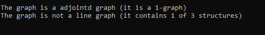

# Linear graph algorithm, transformation 
> 
> 

## Table of Contents
* [General Info](#general-information)
* [Technologies Used](#technologies-used)
* [Features](#features)
* [Project Status](#project-status)
* [Acknowledgements](#acknowledgements)

## General Information
It is a console application that checking if the loaded graph is a graph adjoint and if the graph is a adjointe, transforming it into its original graph.

## Technologies Used
- The tool is written in C++

## Features
- loading any graph directed from a text file,
- checking if the loaded graph is a graph adjoint,
- if the graph is a adjoint, check if it is a line graph,
- printing a message about the result of the above check,
- if the graph is a adjoint, transforming it into its original graph (H),
- saving the result graph H to a text file other than the input file, but in the same format. 

## Usage

Position the file in the program that contains the graph you want to examine and run the program.

### Graph example 

### Sample program output 

## Project Status
Project is: _no longer being worked on_. 

## Acknowledgements

This project was inspired by:
- C. Berge, Graphs and Hypergraphs, North-Holland Publishing Company, London, 1973.
- J. Błażewicz, A. Hertz, D. Kobler, D. de Werra, On some properties of DNA graphs, Discrete Applied Mathematics 98, 1-19, 1999.

